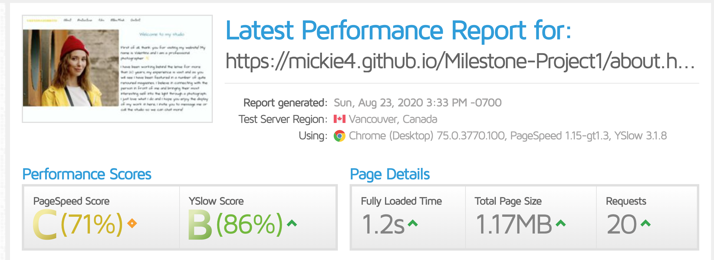

  

# Description
*this is a fictitious person*

Valentina's studio is a well knowned studio in the heart of Brick Lane; Valentina started her career as a photographer in Milan and has worked with top names in the fashion and film business over the years, she has stablised her studio in London and is ready to become more mainstream. 

# Deployment and Demo

Website has been deployed to [GitHub Pages](https://github.com/Mickie4/Milestone-Project1)

# Wireframe

The wireframe was designed using [Sketch](https://www.sketch.com/)
 
## UX
 
 Valentina is a very easy going and hip person, I opted for a website that could reflect that aspect of her personality whilst showcasting her top class work and vast experience.

Landing Page: Has a video showcasting Valentina in a closeup which is responsive in all screen sizes, it gives the user an inmediate taste of the quality of her work.

About Page: Contains a small welcoming message from Valentina and it displays logos of the magazines she has been featured with in the past.

Portraiture Page: It displays Valentina's work that is available for purchase, it it shows every image in a card order with the name and of the product with a button that gives the option to add to a shopping cart. When you click on the image it displays on a lightbox for the user to appreaciate it with more detail. Below every image there is an icon of a shopping cart and a plus sign, if they click on it it opens a modal mocking a shopping card list with the image information, price, option to add more quantity, subtotal and a button to take you to a check out page.

Film Page: it shows 3 videos with their titles and location information for users to get an idea of her work.

Other Work Page: it displays the other categories of photography and filming that Valentina offers at her studio. 

Contact Page: It has a clean and simple contact form for users to send their questions or request directly, opening hours information and a map for users to find the studio with google maps.

All pages have a footer that includes all of Valentina's Social media links and her logo.

  

This is a quite heavy website due to the high quality resolution on both video and photography; in order to help this issue I have used [tinypng.com](https://tinypng.com/) this reduced the size by 58%.

  

# Visual Identity

- The logo was created by me using [Sketch](https://www.sketch.com/)
- All the images were downloaded from [Unsplash](https://unsplash.com/
- All the videos were downloaded from [Pexels](https://www.pexels.com/)
- The Favicon was made by me using [Sketch](https://www.sketch.com/)
- I used the library from [Hover.css](https://ianlunn.github.io/Hover/) for some of the effects.
- I used the animation library from [Vivify](http://vivify.mkcreative.cz/) for some of the elements.
- All the fonts came from [Google Fonts](https://fonts.google.com/)

# User stories

-	As a user I want to be able to see who Valentina has worked with in the past to verify her experience.
-	As a user I need to be able to navigate the website in a simple and intuitive way.
- As a user I want to be able to find Valentina's other pages such as instagram and see how many followers she has there, verify who follows her too as that could be an indication of how high up in the industry she has worked before.
-	As a user I need to be able to get in contact with Valentina and to be able to find her studio and operating information. 

Website Owner:
- As a website owner I will like to showcast my work.
- As a website owner I will like to prompt visitors to follow me on my social media
- As a website owner I will like to recieve in an easy format any queries from potential customers.

# Testing

Webiste was tested using [GTmetrix](https://gtmetrix.com/), see the results below:

  

# Scalability
•	The option to change the content into a different language (Spanish)
•	Adding an ecommerce page for selling photography.
•   An automatic booking system where customers can reserve slots of the day for a session.

## Technologies

- Boostrap 
    - I used this framework to build the website https://getbootstrap.com/
- CSS & HTML
    - Since this was an only frontend project these are the two building blocks I used.

# Media 

As previously mentioned, all the images were downloaded from [Unsplash](https://unsplash.com/) however in here you can find every artist's community profile link and their work.

- [Senjuti Kundu](https://unsplash.com/@senjuti)
- [Albert Dera](https://unsplash.com/@albertdera)
- [Artem Labunsky](https://unsplash.com/@labunsky)
- [Pamela Saunders](https://unsplash.com/@pamsaunders)
- [Sarah Louise Kinsella](https://unsplash.com/@sarahlouisekinsella)
- [Caique Silva](https://unsplash.com/@caiqueportraits)
- [Elijah M. Henderson](https://unsplash.com/@elijahhenderson)
- [Gabriel Silvério](https://unsplash.com/@gabrielsilverio)
- [Cristian Newman](https://unsplash.com/@cristian_newman)
- [Austin Wade](https://unsplash.com/@austin_wade)
- [Harry Dona](https://unsplash.com/@harrydona)

# Thanks to
- The [Bootstrap](https://getbootstrap.com/) community for creating such an amazing framework!
- [Martin Kníže](https://github.com/Martz90) for working to create this incredible animation library that Vivify is and making it available for everyone to use.
- [Ian Lunn](https://ianlunn.co.uk/) For creating Hover.css and making it free to use.
- [Dudley Storey](http://thenewcode.com/) for teaching me how to use a video as a background on my landing page.
- To the incredible team at [Lapa Ninja](https://www.lapa.ninja/) for helping me get inspiration for my own design.
- And last but certainly not least to my awesome mentor [Felipe Souza Alarcon](https://www.linkedin.com/in/felipe-alarcon/) for always encouraging me, for his helpful and approachable demeanor and for sharing his experience and knowledge to help me.
