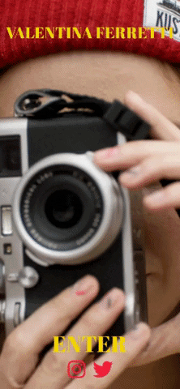

# VALENTINA FERRETTI 

Valentina's studio website is an eye-catching design that allows her to showcast her work and talent behing the camera lense. Valentina needed a website to create online presence and to bring in new contracts and projects.
 
## UX
 
The demographic for her website are men and women between 18-50; predominantly within the fashion, arts and marketing industries. 
Valentina is looking to expand her demographic to more personal and business clients as well as looking to find more film work in London and abroad.

What makes Valentina's website special and to stand out is how clear and easy to navigate it really is, along with the way that her information adn work has been layed out it all makes a beautiful and memorable website. 

Here are some of the user stories we have gathered:

-	As a user I want to be able to see who Valentina has worked with in the past to verify her experience.

-	As a user I need to be able to navigate the website in a simple and intuitive way.

- As a user I want to be able to find Valentina's other pages such as instagram and see how many followers she has there, verify who follows her too as that could be an indication of how high up in the industry she has worked before.

-	As a user I need to be able to get in contact with Valentina and to be able to find her studio and operating information. 

(please refer to the repository for all the PDF files that showcast the  mockups)

* * *

Desktop & Tablet Mockup View:
-------------

Mobile View:
-------------

<<<<<<< HEAD
=======

>>>>>>> f4fbf4abc3661fb72206c42f7602af3243f934bd

## Features

•	The site will include an eye-catching landing page featuring links to their social media profiles and their logo.

•	An “About Us” section to present a brief explanation on how the concept was thought out and what the website offers. 

•	A Portraits section for visitors to get to view Valentina's work

•	A film section with a clip from a project that Valentina participated in. 

•	A contact form, buisness details and a map for customers to visit the studio.

•   Other work page where Valentina advertises all the other kinds of photography she can do

### Features Left to Implement

•	The option to change the content into a different language (Spanish)
•	A section to register for the Newsletter
•	A booking form

## Technologies Used

In this section, you should mention all of the languages, frameworks, libraries, and any other tools that you have used to construct this project. For each, provide its name, a link to its official site and a short sentence of why it was used.

- Sketch 3 
    - I made the mockups with this program https://www.sketch.com/
- Boostrap 
    - I used this framework to build the website https://getbootstrap.com/
- CSS & HTML
    - Since this was an only frontend project these are the two building blocks I used.

## Testing

In this section, you need to convince the assessor that you have conducted enough testing to legitimately believe that the site works well. Essentially, in this part you will want to go over all of your user stories from the UX section and ensure that they all work as intended, with the project providing an easy and straightforward way for the users to achieve their goals.

Whenever it is feasible, prefer to automate your tests, and if you've done so, provide a brief explanation of your approach, link to the test file(s) and explain how to run them.

For any scenarios that have not been automated, test the user stories manually and provide as much detail as is relevant. A particularly useful form for describing your testing process is via scenarios, such as:

1. Contact form:
    1. Go to the "Contact Us" page
    2. Try to submit the empty form and verify that an error message about the required fields appears
    3. Try to submit the form with an invalid email address and verify that a relevant error message appears
    4. Try to submit the form with all inputs valid and verify that a success message appears.

In addition, you should mention in this section how your project looks and works on different browsers and screen sizes.

You should also mention in this section any interesting bugs or problems you discovered during your testing, even if you haven't addressed them yet.

If this section grows too long, you may want to split it off into a separate file and link to it from here.

## Deployment

This section should describe the process you went through to deploy the project to a hosting platform (e.g. GitHub Pages or Heroku).

In particular, you should provide all details of the differences between the deployed version and the development version, if any, including:
- Different values for environment variables (Heroku Config Vars)?
- Different configuration files?
- Separate git branch?

In addition, if it is not obvious, you should also describe how to run your code locally.

## Credits

### Content
- All mock text was generated with Sketch 3

### Media
- All the images used for this website were downloaded from unsplash.com

### Acknowledgements

I received inspiration for these websites:
- https://www.dropbox.design/?ref=lapaninja 
- https://repolovers.com/?ref=lapaninja
- https://buzzusborne.com/?ref=lapaninja
